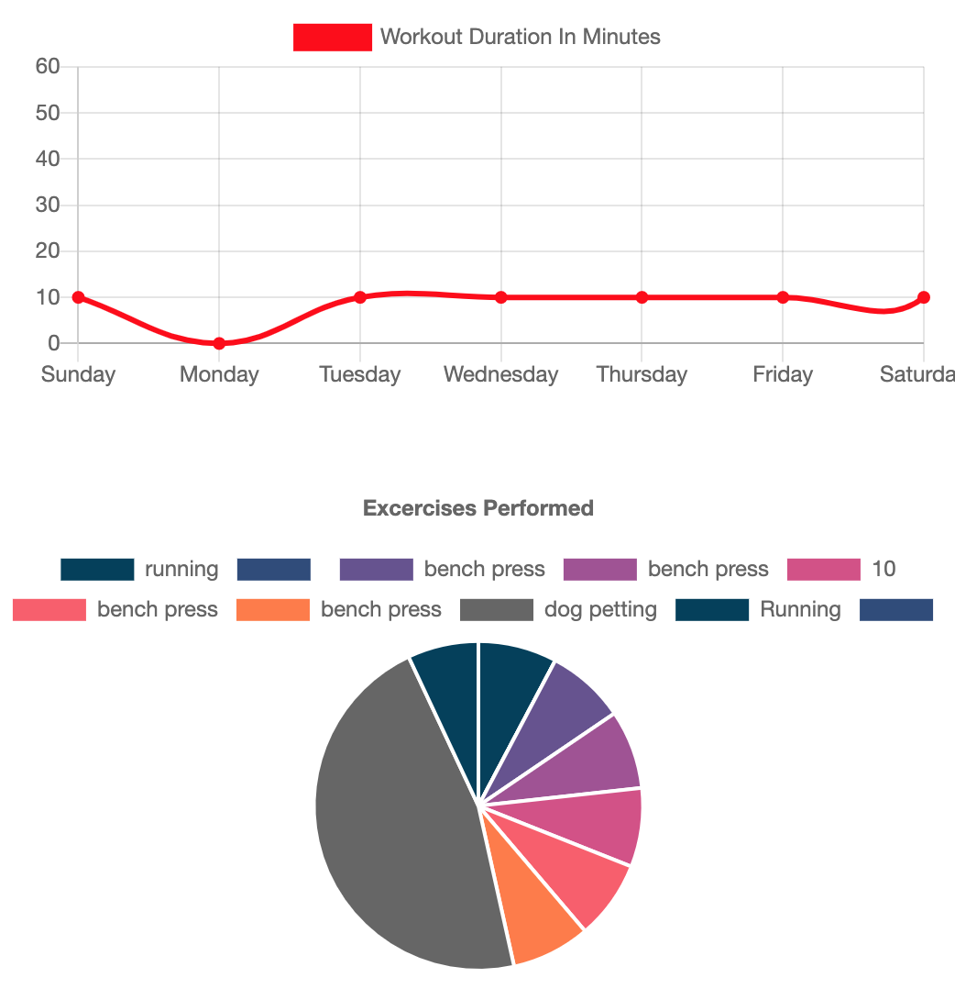
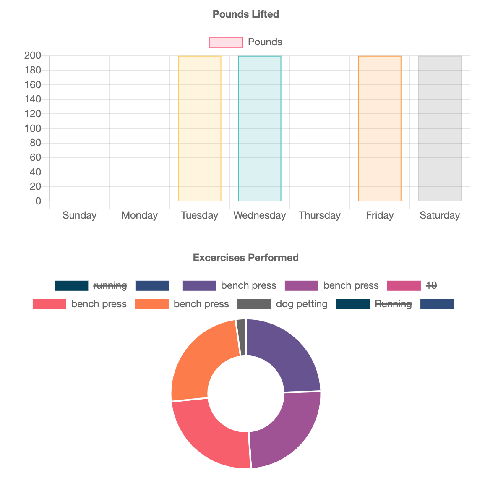

# fitness_tracker

## Description
> As a user, I want to be able to view create and track daily workouts. I want to be able to log multiple exercises in a workout on a given day. I should also be able to track the name, type, weight, sets, reps, and duration of exercise. If the exercise is a cardio exercise, I should be able to track my distance traveled.

## Table of Contents
* [Installation](*installation)
* [Usage](*usage)
* [License](*license)
* [Contribute](*contribute)
* [Credits](*credits)

## Installation
> No installation necessary, just go to https://pacific-inlet-57348.herokuapp.com/
## Usage
>used to track user exercise and progress
### License
> Open Source
#### Contribute
> Jimmy made this

